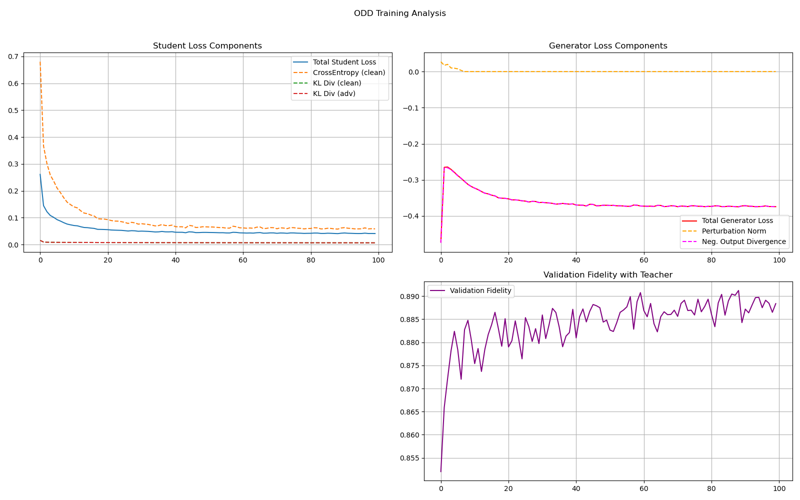
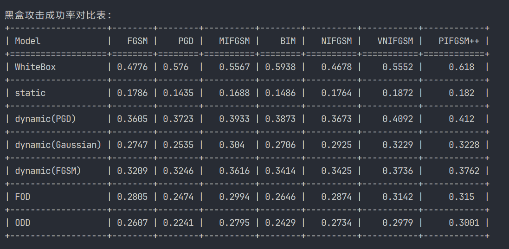

# GAD-Attack 项目说明

本项目实现了针对SVHN数据集的ResNet18模型训练、模型蒸馏以及黑盒攻击测试流程，旨在研究模型防御与攻击的有效性。同时，进行了去除梯度约束的蒸馏方法（ODD）的实验，探索其在黑盒攻击中的表现。

## 环境依赖

- **Python >= 3.10**
- **PyTorch >= 2.0**
- **CUDA >= 11.7**

## 复现流程

### **Step 1: 训练 ResNet18 模型**

此步骤将训练一个经过PGD对抗训练的、鲁棒的ResNet-18模型，作为所有后续实验的攻击目标。

```bash
python train_resnet18_svhn_acc.py
```
- **输出:**
  - `svhn_resnet18_weights_natural.pth`: 标准训练后的模型权重。
  - `svhn_resnet18_weights_adv.pth`: 对抗训练后的模型权重（**核心教师模型**）。

### **Step 2: 进行模型蒸馏**

此步骤将使用不同的蒸馏策略，训练出多个用于黑盒攻击的替代模型。这些脚本可以并行或依次运行。

```bash
# 2.1 训练一阶蒸馏 (FOD) 模型
python zl_1order.py

# 2.2 训练输出分歧蒸馏 (ODD) 模型
python train_odd.py
```
- **输出:**
  - `SVHN_target_modelC_1order_loss3.pth` (来自 `zl_1order.py`)
  - `SVHN_target_model_ODD.pth` (来自 `train_odd.py`)

### **Step 3: 黑盒攻击测试**

此步骤将加载所有训练好的替代模型，对教师模型发起一系列黑盒攻击，并生成最终的性能对比表。

```bash
python test_experiment.py
```
- **输出:**
  - 终端会打印出一个清晰的、格式化的表格，展示了包括白盒攻击在内的所有模型的攻击成功率。

## 代码流程介绍

### 训练ResNet18模型

可在```train_resnet18_svhn_acc.py```中查看训练。

首先，正常训练ResNet18模型识别SVHN数据集

```python
for epoch in range(epochs):
    model.train()
    running_loss = 0.0
    for i, (images, labels) in enumerate(train_loader):
        images, labels = images.to(device), labels.to(device)
        optimizer.zero_grad()
        outputs = model(images)
        loss = criterion(outputs, labels)
        loss.backward()
        optimizer.step()
        running_loss += loss.item()
        if (i+1) % 50 == 0:
            print(f"Epoch [{epoch+1}/{epochs}], Step [{i+1}/{len(train_loader)}], Loss: {loss.item():.4f}")
    train_acc = evaluate(model, train_loader)
    test_acc = evaluate(model, test_loader)
    print(f"Epoch [{epoch+1}/{epochs}] 训练集精度: {train_acc:.4f}  测试集精度: {test_acc:.4f}")
```

得到的结果保存在 ```svhn_resnet18_weights_natural.pth``` 中。此时模型对数据集的识别能力较强，但是面对攻击时鲁棒性较弱。于是进行第二轮PGD标准对抗训练。

```python
adv_epochs = 50  # 对抗训练轮数，可根据需要调整
for epoch in range(adv_epochs):
    model.train()
    running_loss = 0.0
    for i, (images, labels) in enumerate(train_loader):
        images, labels = images.to(device), labels.to(device)
        # 生成PGD对抗样本
        images.requires_grad = True
        adv_images = PGD(model, eps=8/255, alpha=2/255, steps=7)(images, labels)
        optimizer.zero_grad()
        outputs = model(adv_images)
        loss = criterion(outputs, labels)
        loss.backward()
        optimizer.step()
        running_loss += loss.item()
        if (i+1) % 50 == 0:
            print(f"[ADV] Epoch [{epoch+1}/{adv_epochs}], Step [{i+1}/{len(train_loader)}], Loss: {loss.item():.4f}")
    train_acc = evaluate(model, train_loader)
    test_acc = evaluate(model, test_loader)
    print(f"[ADV] Epoch [{epoch+1}/{adv_epochs}] 训练集精度: {train_acc:.4f}  测试集精度: {test_acc:.4f}")

    # 每10轮输出一次PGD攻击成功率
    if (epoch + 1) % 10 == 0 or (epoch + 1) == adv_epochs:
        succ_rate = pgd_attack_success_rate(model, test_loader)
        if succ_rate is not None:
            print(f"[PGD] ADV Epoch {epoch+1}: PGD攻击成功率（识别错误率）: {succ_rate:.4f} ({succ_rate*100:.2f}%)")
        else:
            print(f"[PGD] ADV Epoch {epoch+1}: 未检测到torchattacks库，跳过PGD攻击评测。")
```

得到的结果保存在```svhn_resnet18_weights_adv.pth```中。

### 蒸馏模型

代码见```zl_1order.py```。

加载数据集：
```python
import torchvision
from models import ResNet18_SVHN
svhn_train = torchvision.datasets.SVHN('./dataset', split='train', transform=transforms.ToTensor(), download=True)
svhn_test = torchvision.datasets.SVHN('./dataset', split='test', transform=transforms.ToTensor(), download=True)
```

损失函数设计：

静态蒸馏：
```python
loss_model = alpha * student_loss + (1 - alpha) * ditillation_loss
```

动态蒸馏：
```python
loss_model = alpha * student_loss + (1 - alpha) * ditillation_loss + neighbor_ditillation_loss * 3
```

一阶蒸馏：
```python
loss_model = alpha * student_loss + (1 - alpha) * ditillation_loss + neighbor_mse_loss * 3 + neighbor_ditillation_loss * 3
```

结果分别保存在：
- ```SVHN_target_modelC_static_loss3.pth```
- ```SVHN_target_modelC_dynamic_loss3.pth```
- ```SVHN_target_modelC_1order_loss3.pth```

### 实验对照

代码见```train_odd.py```。

**输出分歧蒸馏 (ODD) :**
  - **学生损失:** `student_loss = alpha * loss_ce + (1 - alpha) * loss_kl_clean + lambda_kl_adv * loss_kl_adv`
  - **核心思想:** 移除了所有梯度/差异相关的约束，只在干净和对抗样本上模仿教师的输出。

结果保存在```SVHN_target_model_ODD.pth```。

### 攻击测试

代码见```test_experiment.py```。

攻击方法和参数：
```python
"FGSM": torchattacks.FGSM(model, eps=8 / 255),
"PGD": torchattacks.PGD(model, eps=8 / 255, alpha=2 / 255, steps=7),
"BIM": torchattacks.BIM(model, eps=8 / 255, alpha=2 / 255, steps=7),
"MIFGSM": torchattacks.MIFGSM(model, eps=8 / 255, steps=7),
"NIFGSM": torchattacks.NIFGSM(model, eps=8 / 255, steps=7),
"VNIFGSM": torchattacks.VNIFGSM(model, eps=8 / 255, steps=7),
"PIFGSM++": torchattacks.PIFGSMPP(model, max_epsilon= 8 / 255, num_iter_set=7),
```


## 实验结果展示

### **教师模型性能**

经过训练，我们得到的教师模型性能如下，它兼具了高自然精度和对PGD攻击的鲁棒性。

| 指标 | 性能 |
| :--- | :--- |
| **自然准确率** (对抗训练后) | **88.36%** |
| **PGD攻击成功率** (白盒) | **52.86%** |

### **蒸馏过程分析 (以ODD为例)**

通过可视化训练过程，我们可以诊断对抗博弈的稳定性。一个健康的训练过程应如下图所示：




### **最终黑盒攻击性能对比**

所有替代模型训练完成后，最终的黑盒攻击成功率对比如下。

