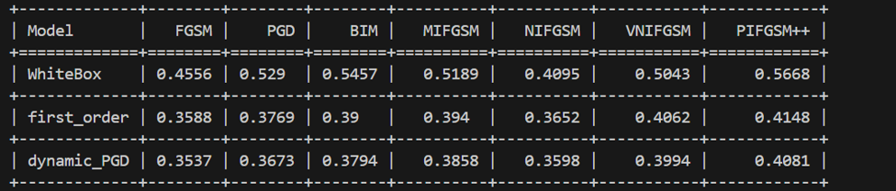

# GAD-Attack 项目说明

本项目实现了针对SVHN数据集的ResNet18模型训练、模型蒸馏以及黑盒攻击测试流程，旨在研究模型防御与攻击的有效性。

## 环境依赖
- Python >= 3.10
- 推荐使用conda或venv创建虚拟环境
- 主要依赖包：
  - torch
  - torchvision
  - numpy
  - tqdm
  - torchattacks
  
## 运行流程

### Step 1 训练ResNet18模型
```
python train_resnet18_svhn_acc.py
```
输出：保存训练好的ResNet18模型权重文件。

### Step 2 进行模型蒸馏
```
python zl_1order.py
```
输出：保存蒸馏后的学生模型权重文件。

### Step 3 黑盒攻击测试
```
python test_blackbox_attacks.py
```
输出：生成攻击结果与相关评估指标。

## 代码流程介绍

### 训练ResNet18模型

可在```train_resnet18_svhn_acc.py```中查看训练。

首先，正常训练ResNet18模型识别SVHN数据集

```python
for epoch in range(epochs):
    model.train()
    running_loss = 0.0
    for i, (images, labels) in enumerate(train_loader):
        images, labels = images.to(device), labels.to(device)
        optimizer.zero_grad()
        outputs = model(images)
        loss = criterion(outputs, labels)
        loss.backward()
        optimizer.step()
        running_loss += loss.item()
        if (i+1) % 50 == 0:
            print(f"Epoch [{epoch+1}/{epochs}], Step [{i+1}/{len(train_loader)}], Loss: {loss.item():.4f}")
    train_acc = evaluate(model, train_loader)
    test_acc = evaluate(model, test_loader)
    print(f"Epoch [{epoch+1}/{epochs}] 训练集精度: {train_acc:.4f}  测试集精度: {test_acc:.4f}")
```

得到的结果保存在 ```svhn_resnet18_weights_natural.pth``` 中。此时模型对数据集的识别能力较强，但是面对攻击时鲁棒性较弱。于是进行第二轮PGD标准对抗训练。

```python
adv_epochs = 50  # 对抗训练轮数，可根据需要调整
for epoch in range(adv_epochs):
    model.train()
    running_loss = 0.0
    for i, (images, labels) in enumerate(train_loader):
        images, labels = images.to(device), labels.to(device)
        # 生成PGD对抗样本
        images.requires_grad = True
        adv_images = PGD(model, eps=8/255, alpha=2/255, steps=7)(images, labels)
        optimizer.zero_grad()
        outputs = model(adv_images)
        loss = criterion(outputs, labels)
        loss.backward()
        optimizer.step()
        running_loss += loss.item()
        if (i+1) % 50 == 0:
            print(f"[ADV] Epoch [{epoch+1}/{adv_epochs}], Step [{i+1}/{len(train_loader)}], Loss: {loss.item():.4f}")
    train_acc = evaluate(model, train_loader)
    test_acc = evaluate(model, test_loader)
    print(f"[ADV] Epoch [{epoch+1}/{adv_epochs}] 训练集精度: {train_acc:.4f}  测试集精度: {test_acc:.4f}")

    # 每10轮输出一次PGD攻击成功率
    if (epoch + 1) % 10 == 0 or (epoch + 1) == adv_epochs:
        succ_rate = pgd_attack_success_rate(model, test_loader)
        if succ_rate is not None:
            print(f"[PGD] ADV Epoch {epoch+1}: PGD攻击成功率（识别错误率）: {succ_rate:.4f} ({succ_rate*100:.2f}%)")
        else:
            print(f"[PGD] ADV Epoch {epoch+1}: 未检测到torchattacks库，跳过PGD攻击评测。")
```

得到的结果保存在```svhn_resnet18_weights_adv.pth```中。

### 蒸馏模型

代码见```zl_1order.py```。

加载数据集：
```python
import torchvision
from models import ResNet18_SVHN
svhn_train = torchvision.datasets.SVHN('./dataset', split='train', transform=transforms.ToTensor(), download=True)
svhn_test = torchvision.datasets.SVHN('./dataset', split='test', transform=transforms.ToTensor(), download=True)
```

损失函数设计：

静态蒸馏：
```python
loss_model = alpha * student_loss + (1 - alpha) * ditillation_loss
```

动态蒸馏：
```python
loss_model = alpha * student_loss + (1 - alpha) * ditillation_loss + neighbor_ditillation_loss * 3
```

一阶蒸馏：
```python
loss_model = alpha * student_loss + (1 - alpha) * ditillation_loss + neighbor_mse_loss * 3 + neighbor_ditillation_loss * 3
```

结果分别保存在：
- ```SVHN_target_modelC_static_loss3.pth```
- ```SVHN_target_modelC_dynamic_loss3.pth```
- ```SVHN_target_modelC_1order_loss3.pth```

### 攻击测试

代码见```test_blackbox_attacks.py```。

攻击方法和参数：
```python
"FGSM": torchattacks.FGSM(model, eps=8 / 255),
"PGD": torchattacks.PGD(model, eps=8 / 255, alpha=2 / 255, steps=7),
"BIM": torchattacks.BIM(model, eps=8 / 255, alpha=2 / 255, steps=7),
"MIFGSM": torchattacks.MIFGSM(model, eps=8 / 255, steps=7),
"NIFGSM": torchattacks.NIFGSM(model, eps=8 / 255, steps=7),
"VNIFGSM": torchattacks.VNIFGSM(model, eps=8 / 255, steps=7),
"PIFGSM++": torchattacks.PIFGSMPP(model, max_epsilon= 8 / 255, num_iter_set=7),
```

## 结果展示

训练ResNet18模型后，对抗训练前和对抗训练后的自然精度如下所示：

|对抗训练前|对抗训练后|
|:-----:|:-----:|
|92.66%|88.36%|

PGD的攻击成功率为：52.86%

蒸馏中，生成器Loss示意：


最终结果示意：

